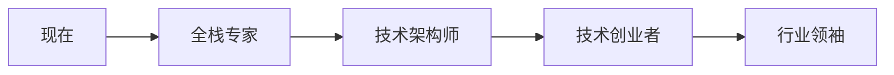

# 🌟 shimu-ui 的 GitHub 个人主页

<div align="center">
  


</div>

<div align="center">
  
## 🎯 当前状态
  


</div>

---

## 🚀 关于我

<div align="center">
  
### 🎨 一位充满激情的全栈开发者

</div>

> *"代码改变世界，技术连接未来"* ✨

🔭 我是一个充满好奇心的**全栈开发者**，热衷于探索技术的前沿领域  
🌱 专注于**区块链**、**人工智能**、**AR/VR**等新兴技术的融合应用  
👯 喜欢参与开源项目，与全球开发者一起创造有意义的产品  
⚡ 相信技术可以让世界变得更美好  

<div align="center">
  


</div>

---

## 🛠️ 技术栈

<div align="center">

### 后端开发


### 前端开发


### 移动开发


### 区块链 & Web3


### AI & 计算机视觉


### 数据库 & 工具


</div>

---

## 📊 GitHub 数据统计

<div align="center">


</div>

<div align="center">


</div>

<div align="center">


</div>

---

## 🏆 成就与荣誉

<div align="center">


</div>

---

## 🎯 精选项目

<div align="center">

### 🚀 我的最新作品

</div>

<table align="center">
<tr>
<td width="50%" align="center">

**📝 个人博客系统**

[](https://github.com/shimu-ui/blog-system)


🚀 全栈博客系统，支持动态内容管理和 🎭 Live2D 看板娘集成

</td>
<td width="50%" align="center">

**🔗 区块链数字证书系统**

[](https://github.com/shimu-ui/blockchain-certificate)


⛓️ 基于以太坊的模块化数字证书 DApp，采用 ERC-721 标准

</td>
</tr>
<tr>
<td width="50%" align="center">

**🌿 供应链溯源平台**

[](https://github.com/shimu-ui/supply-chain)


🏢 企业级溯源平台，实现从种植到物流的全流程透明化管理

</td>
<td width="50%" align="center">

**🏮 文旅助农小程序**

[](https://github.com/shimu-ui/tourism-miniprogram)


🚀 融合区块链、AR、AI等前沿技术，助力乡村振兴

</td>
</tr>
</table>

---

## 🌟 技能与专长

<div align="center">

### 💻 技术熟练度


### 📈 技能进度
```text
JavaScript   ████████████████████   100%
Node.js      ██████████████████     90%
Vue.js       ██████████████████     90%
Python       ████████████████       80%
Solidity     ███████████████        75%
React        ██████████████         70%
AI/ML        ████████████           60%
```

</div>

---

## 🎨 除了代码之外

<div align="center">

### 🌈 生活与兴趣


</div>

> *"设计让技术更有温度，摄影教会我用不同角度看待世界，音乐是我的灵感源泉"* 🎵

### 🎯 个人价值观
- 🌱 **持续学习**: 保持对新技术的好奇心和学习热情
- 🤝 **开源精神**: 积极参与开源社区，分享知识和经验
- 🎨 **用户体验**: 始终将用户需求和体验放在首位
- 🌍 **社会责任**: 用技术创造价值，让世界变得更美好

---

## 🚀 未来目标

<div align="center">

### 🎯 2024年规划

</div>

- 🔥 **深度学习**: 掌握先进的AI/ML技术和大语言模型应用
- 🦀 **Rust精通**: 成为Rust系统编程和Web3开发的专家
- 🌐 **Web3创新**: 探索DeFi、DAO和下一代区块链应用场景
- 🚀 **开源贡献**: 为开发者社区贡献更多优质的开源项目
- 📚 **知识分享**: 通过博客和技术分享帮助更多开发者成长

### 🛣️ 长期愿景


---

## 📈 今年的贡献

<div align="center">


</div>

---

## 📬 联系我

<div align="center">

### 🤝 让我们连接吧！

[](https://github.com/shimu-ui)
[](https://space.bilibili.com/3494375472499132)
[](mailto:shimuui280@gmail.com)
[](#)
[](#)

</div>

<div align="center">

### 📊 联系方式统计


</div>

---

## 🌈 有趣的事实

<div align="center">

### 🎭 关于我的一些趣事

</div>

- 🎮 **游戏爱好者**: 热爱策略游戏和独立游戏，它们激发我的创造力
- 🍕 **代码与美食**: 边写代码边品尝世界各地的美食是我的最爱
- 🌙 **夜猫子程序员**: 最佳编程时间是晚上10点到凌晨2点
- 📖 **技术书虫**: 每月至少阅读2本技术书籍和1本非技术书籍
- 🎵 **代码配乐**: 编程时喜欢听爵士乐和电子音乐
- 🏃‍♂️ **运动健身**: 每周至少跑步3次，保持身心健康

<div align="center">


</div>

---

## 💡 每日一句

<div align="center">


</div>

---

## 🔥 热门仓库

<div align="center">


</div>

---

<div align="center">

## 🎉 访问统计


</div>

<div align="center">

### 🙏 感谢每一位访问者


</div>

<div align="center">

---

### 🚀 *"代码改变世界，梦想照亮未来！"*

**感谢你的访问！希望在这里能找到一些有趣的东西！** 🌟

---

</div>

<!-- 动态表情区域 - 使用GitHub支持的方式 -->
<div align="center">

## 🎭 今日心情

<!-- 这里可以通过GitHub Actions定期更新 -->
### 🚀 ✨ 💫 🌟 🔥 💻 🎨 ⚡

</div>

<!-- 隐藏的统计信息，用于SEO和搜索 -->
<!-- 
关键词: shimu-ui, 全栈开发, 区块链, AI, Web3, 前端开发, 后端开发, JavaScript, Python, Vue.js, React, Node.js, Solidity
技术栈: 全栈开发者, 区块链开发者, AI爱好者, Web3开发, DApp开发, 智能合约, 机器学习, 深度学习
-->
